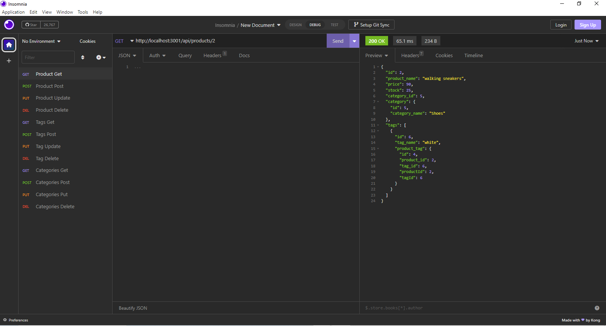
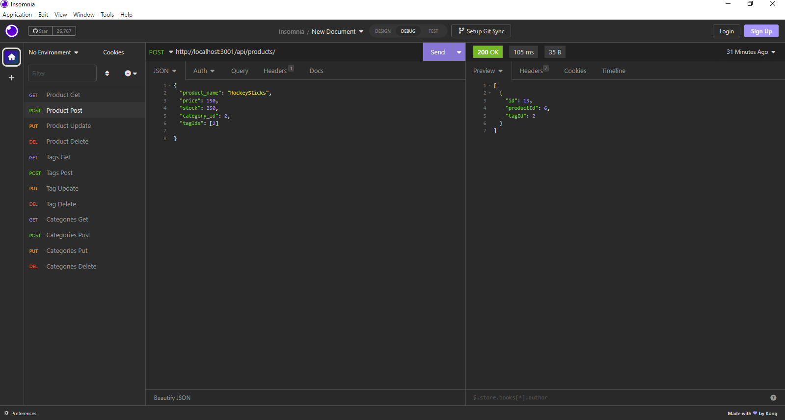

# eCommerce Back End

## Description

This is a back end for an e-commerce site. It uses the latest technologies so that the company can compete with other e-commerce companies. It uses Express.js API and Sequelize to interact with a MySQL database. This app showcases the ability to view, add, update, delete from an eCommerce database that uses multiple relationships in it's structure. In creating this application I learned how to use Sequelize to interact with a MySQL database. I also learned how to use Insomnia to test the routes and how to use dotenv to hide sensitive information. Using this app, the user can keep a layered database organised and connected, while keeping their system up to date on the products they offer. My strengths in navigating databases and routes through Insomnia have greatly increased and strengthened my skills in this area. I am excited to continue to learn and grow in this area.

## Table of Contents

- [Installation](#installation)
- [Usage](#usage)
- [Credits](#credits)
- [License](#license)
- [Contact](#contact)

## Installation

Here are a few steps to get you started:

- Clone the repository from: https://github.com/TamasPinter/eCommBE
- Open the repository in your code editor and run the terminal commands:
    - npm install   <-- to install the dependencies
    - connect to your mysql server and run the schema.sql file
    - return to your terminal and run the seeds/index.js file
    - you will need to create a .env file and add your mysql username and password to it
    - run the command npm start to engage the server and begin testing the routes in Insomnia

## Usage

To use the application once all the Installation steps have been completed, you can use Insomnia to test the routes. You can use GET/GET by ID/POST/PUT/DELETE to test the routes in the database. Each command will have it's own json needs, use a GET first to see the object structure and then use the POST to add a new object. Use the PUT to update an existing object and the DELETE to remove an object from the database. Here is a screenshot of the Insomnia testing:

and here is a video guide link showing the basic functions from installation to testing the routes:

https://drive.google.com/file/d/1uskdPhLnTpWM52HLKo0GzrjGkPlENXX-/view

## Credits

Thank you to my instructional team and fellow classmates for their help and support debugging and working through this project.

## License

MIT License

Copyright (c) 2023 TamasPinter

Permission is hereby granted, free of charge, to any person obtaining a copy
of this software and associated documentation files (the "Software"), to deal
in the Software without restriction, including without limitation the rights
to use, copy, modify, merge, publish, distribute, sublicense, and/or sell
copies of the Software, and to permit persons to whom the Software is
furnished to do so, subject to the following conditions:

The above copyright notice and this permission notice shall be included in all
copies or substantial portions of the Software.

THE SOFTWARE IS PROVIDED "AS IS", WITHOUT WARRANTY OF ANY KIND, EXPRESS OR
IMPLIED, INCLUDING BUT NOT LIMITED TO THE WARRANTIES OF MERCHANTABILITY,
FITNESS FOR A PARTICULAR PURPOSE AND NONINFRINGEMENT. IN NO EVENT SHALL THE
AUTHORS OR COPYRIGHT HOLDERS BE LIABLE FOR ANY CLAIM, DAMAGES OR OTHER
LIABILITY, WHETHER IN AN ACTION OF CONTRACT, TORT OR OTHERWISE, ARISING FROM,
OUT OF OR IN CONNECTION WITH THE SOFTWARE OR THE USE OR OTHER DEALINGS IN THE
SOFTWARE.

## Contact

If you have any questions please feel free to email me at: brolli_673@hotmail.com

or visit my GitHub page for other projects: https://github.com/TamasPinter
---
